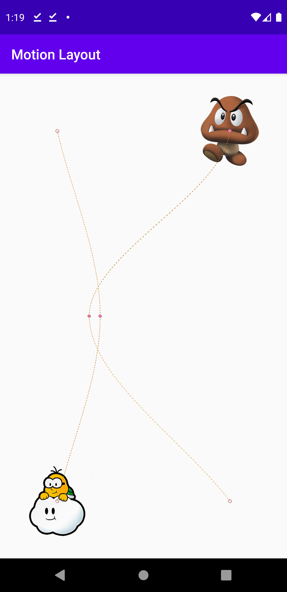
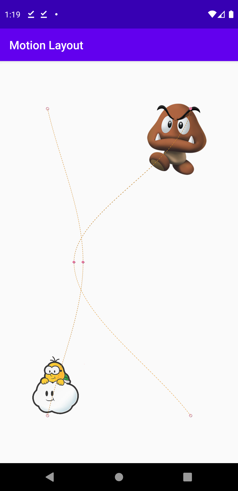
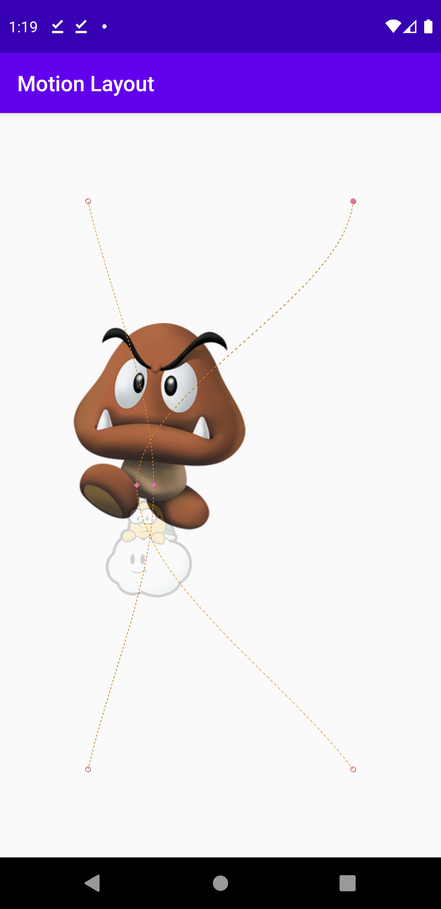
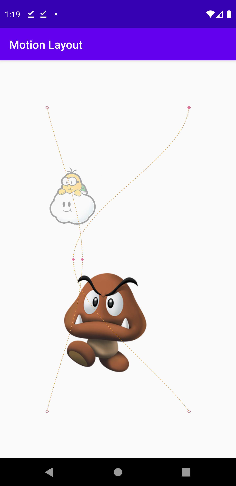

# MotionLayout

### **Overview - About this project**
Simple project using **MotionLayout** to handle different animations


### 📷 How is this App
</img>
</img>
</img>
</img>


### 💻Technology
- [Kotlin](https://kotlinlang.org/)

### Libraries
```bash
    implementation 'androidx.constraintlayout:constraintlayout:2.0.0-beta6'
 ```
